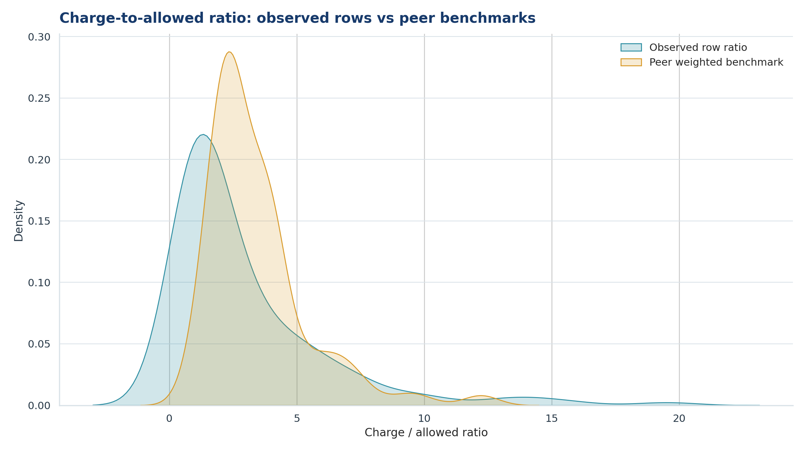
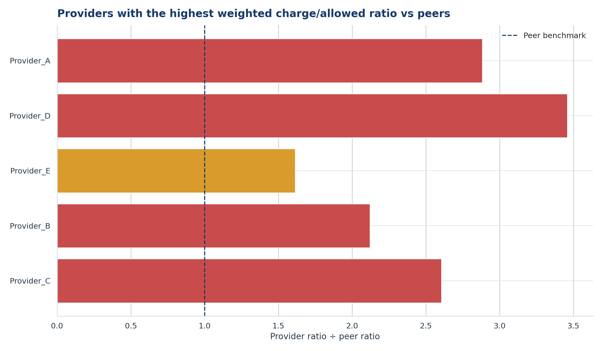
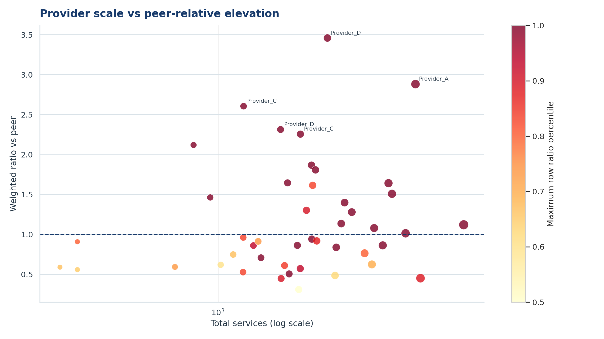
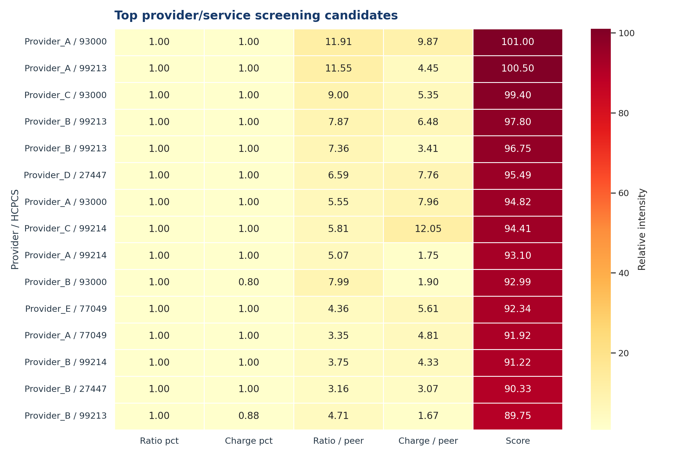
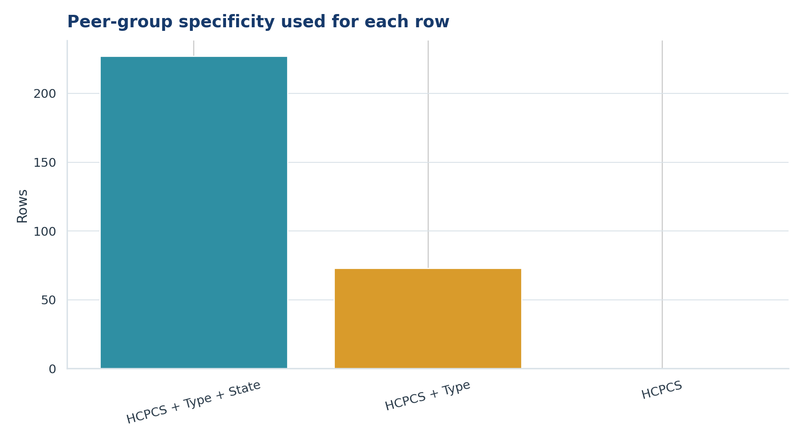

# Forensic Healthcare Billing Screen — Peer-Group Analysis

## Overview
A reproducible Python/pandas workflow that compares healthcare provider billing rows against peer benchmarks using a hierarchical peer-group strategy.

## Business Problem
Identify provider/service combinations whose submitted charges or charge-to-allowed ratios are unusually elevated relative to comparable peers.

> This is a screening aid, not a fraud determination.

## Sample Output

**Charge-to-allowed ratio: observed rows vs peer benchmark**

**Providers with the highest weighted ratio vs peers**

**Provider scale vs peer-relative elevation**

**Top screening candidates**

**Peer-group specificity used per row**

Full report: [`docs/peer_group_visual_report.pdf`](docs/peer_group_visual_report.pdf)

## Peer Hierarchy
1. Same HCPCS + provider type + state
2. Same HCPCS + provider type
3. Same HCPCS

## Metrics
- Services-weighted peer benchmarks
- Charge-to-peer-charge ratio
- Ratio-to-peer-ratio
- Percentile rank
- Robust z-score (median/MAD)
- Composite screening score and band

## Documentation
- [Data dictionary](docs/data_dictionary.md)
- [Methodology](docs/methodology.md)

## Data
- Input: Excel workbook with provider, HCPCS, state, type, beneficiaries, services, average charge, average allowed, average payment, and charge-to-allowed ratio.
- Public repo uses synthetic sample data only.

## How to Run
~~~
pip install -r requirements.txt
python scripts/make_synthetic_data.py
python peer_group_billing_analysis.py --input data/sample/synthetic_billing_sample.xlsx --output outputs/peer_analysis.xlsx
python peer_group_visualizations.py --input outputs/peer_analysis.xlsx --output-dir outputs/figures
~~~

## Tech Stack
Python, pandas, NumPy, Matplotlib, Seaborn, XlsxWriter.

## Ethical / Legal Note
This project is for analytical screening and research. It does not prove fraud, waste, or abuse. Follow all applicable privacy, HIPAA, and contractual requirements.

## Author
Daniel Ojo — [GitHub](https://github.com/Daniel38215571) · [LinkedIn](https://linkedin.com/in/daniel-ojo-879273197)
